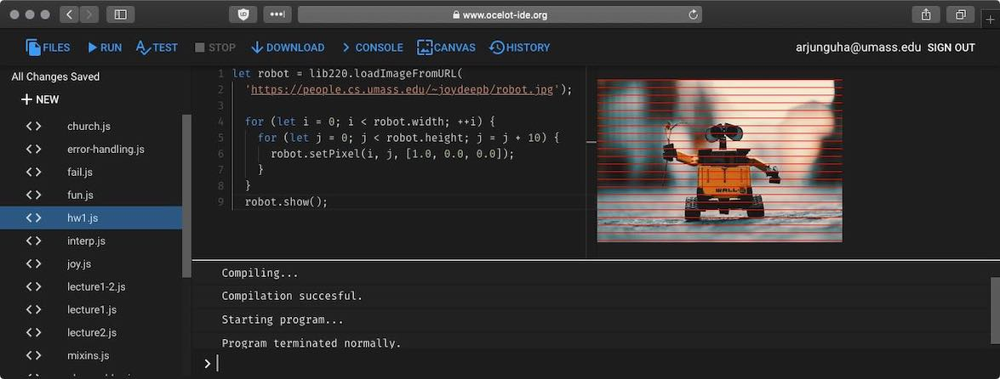

Ocelot is a web-based IDE that we use to teach an introductory software
engineering course at University of Massachusetts Amherst.[^1] The IDE has
the following features:

1. It saves files continuously and maintains a fine-grained history of edits.
2. It integrates support for testing, graphics, and other helpful libraries.
3. It compiles and runs code entirely in the browser.
4. It has a REPL.

Therefore, Ocelot works with a flaky Internet connection, works on any
device that has a web browser, and limits the risk of students losing their
work.

# JavaScript Without the "Bad Parts"

The **most significant feature** of Ocelot is that shields students from the
"bad parts" of JavaScript.[^2] Therefore, it makes JavaScript a reasonable
programming language to teach to relatively new programmers.  Ocelot supports a
restricted subset of JavaScript that we call *ElementaryJS*[^3].

JavaScript is a powerful, but complicated language with several poorly-designed
features that can confuse even expert programmers.[^4] This makes JavaScript a
poor choice for teaching beginners how to code.  ElementaryJS uses a
combination of static and dynamic checks to eliminate JavaScript's most
egregious features. For example:

1. ElementaryJS checks for arity-mismatch errors. For example:
   ```javascript
   function F(x) { return x; }
   F(1, 2)
   ```
   JavaScript would silently consume the second argument, but
   ElementaryJS produces an error:
   <pre style="color:red; background-color:#484848; font-weight: bold; font-family:'Fira Mono', monospace">
   function F expected 1 argument but received 2 arguments at Line 1: in F
   ... Line 2
   </pre>
2. In ElementaryJS, you cannot reference non-existent fields. For example:
   ```javascript
   function F(o) { return o.y; }
   let obj = { x: 100 };
   F(obj);
   ```
   JavaScript would return the value `undefined`, but
   ElementaryJS produces an error:
   <pre style="color:red; background-color:#484848; font-weight: bold; font-family:'Fira Mono', monospace">
   object does not have member 'y' at Line 3
   </pre>
3. In ElementaryJS, you cannot dynamically add or remove fields from an object. For example:
   ```javascript
   let obj = { x: 100 };
   obj.y = 10;
   ```
   JavaScript would dynamically create a new field named `y`, while ElementaryJS
   produces an error:
   <pre style="color:red; background-color:#484848; font-weight: bold; font-family:'Fira Mono', monospace">
   object does not have member 'y' at Line 2
   </pre>
4. ElementaryJS checks that operators receive operands with the right type. For example:
   ```javascript
   [] + []
   ```
   JavaScript would produce the empty string `""` without any errors, while
   ElementaryJS produces an error:
   <pre style="color:red; background-color:#484848; font-weight: bold; font-family:'Fira Mono', monospace">
   arguments of operator '+' must both be numbers or strings at Line 1
   </pre>
4. ElementaryJS requires block scoping and disallows the `var` keyword.
5. ElementaryJS disallows the `==` operator and forces programmers to use
   strict equality (`===`).
6. ElementaryJS simplifies JavaScript's standard library in several ways.
   For example, JavaScript's `Array.prototype.map` method passes several
   extra arguments to the mapper function (the index, the array, etc).
   The `map` method in ElementaryJS is simply the normal definition of map.

ElementaryJS has several other restrictions. However, an important design
decision that we made is that *programs that run in ElementaryJS will run
without any changes in ordinary JavaScript*. Therefore, students learn
comprehensible portion of JavaScript that works in the real world.

#  Web Programming Without Callbacks

To write interesting web programs with images, animations, and interactivity,
it is necessary for the programmer to understand callbacks and the event loop.
However, these concepts are hard for new programmers to understand. In Ocelot,
we simulate blocking I/O in JavaScript,[^5] thus students can start writing
interesting programs immediately.  For example, the following program prints
`Hello` every second and runs forever:
```javascript
let i = 0;
while (true) {
  lib220.sleep(1000);
  console.log("Hello " +  i.toString());
  i = i + 1;
}
```

The program uses a *sleep* function that we provide, which is quite hard to
define in JavaScript without locking up the browser. However, Ocelot ensures
that the browser remains responsive and you can stop the program at any time by
clicking the Stop button.

We also provide easy access to drawing on a canvas, which 
can be used to create animations without timer events or
`requestAnimationFrame`:
```javascript
let c = lib220.newCanvas(400, 400);
let theta = 0;
while (true) {
  c.clear();
  let x = 200 + 100* Math.cos(theta);
  let y = 200 + 100* Math.sin(theta);
  c.drawLine(200, 200, x, y, [0, 0.2, 0.8]);
  c.drawCircle(200, 200, 100, [1, 0.5, 0]);
  theta += Math.PI / 100;
  lib220.sleep(16);
}
```

For some more examples, check out this [Animated Robot Path Planner (RRT)] (based on a
programming assignment from our class) and this [bouncing ball animation] in Ocelot.

# Getting the Code

Ocelot is open source and available on GitHub. You can check it out live at
[www.ocelot-ide.org](https://www.ocelot-ide.org/). Without logging in,
you cannot save files or load remote images, but the programs linked above
will still work. We are in the process of writing a deployment guide. If you're
curious about using Ocelot yourself, please get in touch.

# Inspiration

Since 2009, Bootstrap has taught algebra and computing to thousands of students
using web-based IDEs for Scheme (<a
href="http://www.wescheme.org">WeScheme</a>) and <a
href="https://www.pyret.org">Pyret</a>. Ocelot allows students to use a fragment
of JavaScript instead and uses [Stopify] under the hood, which we developed
with the authors of Pyret.


## Authors

The primary developer of Ocelot and ElementaryJS is [Sam Lee] (junior at UMass Amherst).
[Joydeep Biswas] and [Arjun Guha] have also contributed.

[^1]: The course is [COMPSCI 220 Programming Methodology].

[^2]: [JavaScript: The Good Parts] lists several bad parts and awful parts of the language too.

[^3]: ElementaryJS is a [language-level] for JavaScript, inspired by the language-levels of DrRacket.

[^4]: Gary Bernhardt's [Wat] talk illustrates several questionable features of JavaScript (and other languages). The examples in the talk do not work in ElementaryJS.

[^5]: Ocelot uses [Stopify] under the hood, which implements continuations and more for JavaScript.

[COMPSCI 220 Programming Methodology]: https://umass-compsci220.github.io
[language-level]: https://docs.racket-lang.org/drracket/htdp-langs.html
[Wat]: https://www.destroyallsoftware.com/talks/wat
[Sam Lee]: https://lchsam.github.io/
[Arjun Guha]: https://people.cs.umass.edu/~arjun/main/home/
[Joydeep Biswas]: https://www.joydeepb.com
[JavaScript: The Good Parts]: http://shop.oreilly.com/product/9780596517748.do
[Stopify]: http://www.stopify.org
[Animated Robot Path Planner (RRT)]: https://gist.github.com/joydeep-b/1f40f8584709404c07f1da24d025a194
[bouncing ball animation]: https://gist.github.com/joydeep-b/8956ab7ab21e36a0f4c12fa289f952a4
[Ocelot]: https://www.ocelot-ide.org/
